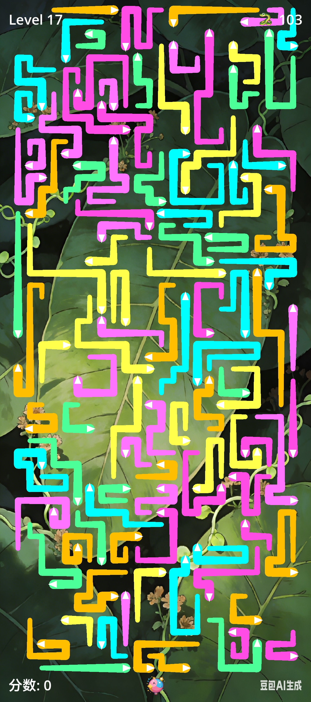

# Godot Games 合集

本仓库是一个基于 **Godot Engine** 的游戏合集，收录了使用 Godot + AI 开发的各类独立小游戏。每个游戏都有独立的目录和完整的项目结构，方便单独运行或学习参考。

> 更多游戏持续添加中，敬请期待！

---

## 🎮 游戏列表

### Snake Untangle（蛇群解结）

一款基于网格的拓扑解谜游戏，玩家需要引导缠绕的霓虹小虫移出屏幕，解开错综复杂的缠绕局面。

**核心玩法：**
- 点击小虫头部的箭头方向，使其沿该方向直线移动
- 小虫以贪吃蛇方式移动：头部前进，身体依次跟随
- 头部碰到其他小虫身体时会反弹（尾巴变头，原路退回）
- 只有头部和尾部都没有被压住的小虫才能移动
- 将所有小虫移出屏幕边界即可过关

**特色系统：**
- **炸弹道具**：可强制移除一只小虫，但费用随连续使用指数增长
- **霓虹视觉**：多彩霓虹小虫 + 程序化发光效果
- **动态背景**：每关随机切换背景
- **完整音效**：操作、碰撞、消除、爆炸均有对应反馈

📂 [进入项目目录](./Snake_Untangle)  
📖 [查看详细说明](./Snake_Untangle/README.md)

---

## 🛠️ 通用说明

- 所有游戏均使用 **GDScript** 开发
- 每个子目录都是独立的 Godot 项目，可直接用 Godot 编辑器打开
- 欢迎参考、学习或提交改进

